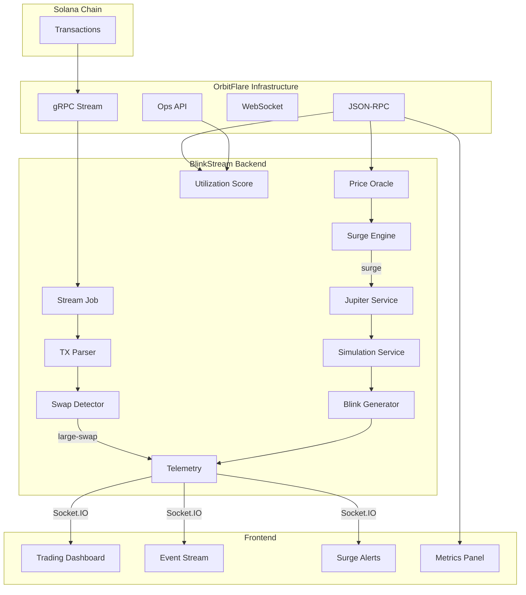

<p align="center">
  
  
  
  
  
</p>

# ⚡ BlinkStream

**Real-Time Solana Signal Detection & One-Click Trade Execution via Blinks**

BlinkStream is a full-stack Solana infrastructure application that streams live on-chain transactions, detects trading signals (large swaps & price surges), and instantly generates shareable **Solana Action Blinks** — enabling anyone to execute a trade in one click.

> **Detect → Analyze → Generate Blink → Trade** — all in under 1 second.

---

## 🎯 What Problem Does BlinkStream Solve?

On-chain trading opportunities are fleeting. By the time you manually spot a whale swap, open a DEX, configure a trade, and sign the transaction — the moment has passed.

**BlinkStream automates this entire pipeline:**

1. **Streams** every Solana transaction in real-time via OrbitFlare gRPC
2. **Detects** large swaps ($10K+) and price surges across multiple tokens
3. **Generates** a Solana Action Blink with a Jupiter swap pre-configured
4. **Delivers** the Blink to your dashboard — click once, wallet signs, trade executes

---

## 🏗️ Architecture



---

## ✨ Features

### 🔴 Real-Time Transaction Streaming
- Connects to OrbitFlare's **gRPC stream** for live Solana transaction ingestion
- **Auto-reconnect** with exponential backoff on connection failures
- **Signature deduplication** prevents duplicate event processing
- **Backfill recovery** fetches missed transactions on reconnect via `getSignaturesForAddress`
- Supports both filtered (account-specific) and broad (all-transaction) stream modes

### 🐋 Large Swap Detection
- Parses raw Solana transaction instructions (SPL Token, DEX programs)
- Identifies input/output mints, amounts, and program IDs
- Flags swaps exceeding **$10,000 USD** threshold
- Emits real-time `large-swap` events to connected frontends

### 📈 Multi-Token Price Surge Engine
- Per-token state machine tracking price movements
- Configurable **surge threshold** (default: 3%) and **cooldown** (default: 30s)
- Monitors multiple tokens simultaneously: SOL, BONK, JUP, and more
- **Runtime-adjustable** settings via API — no restart required
- Anti-spam safeguard prevents duplicate alerts within 60 seconds

### ⚡ Instant Blink Generation
When a signal fires, BlinkStream automatically:
1. Fetches a **Jupiter swap quote** for the detected token pair
2. **Simulates** the swap transaction for safety validation
3. Generates a **Solana Action-compliant Blink URL** with full latency tracking
4. Wraps in **dial.to** for browser-friendly one-click execution (HTTPS deployments)

Typical end-to-end latency: **< 800ms** (quote + simulation + blink creation)

### 💰 Multi-Token Price Oracle
- **Pyth Network Hermes** integration for real-time oracle prices
- **15+ curated tokens**: SOL, BTC, ETH, USDC, BONK, JUP, PYTH, RAY, ORCA, MEW, etc.
- **Any SPL token** supported via mint address → Jupiter quote fallback
- Smart price ID caching with 10-minute TTL
- Supports both symbol lookup and raw mint address pricing

### 🏷️ Intelligent Token Name Resolution
- **Seamless UX**: Users can paste any raw Solana mint address (e.g., `4k3Dyjzvzp8eMZWUXbBCjEvwSkkk59S5iCNLY3QrkX6R`)
- **Instant Resolution**: The system automatically queries the **Jupiter Token List API** to resolve it to a human-readable symbol (e.g., **RAY**).
- **Universal Application**: Propagates across the entire UI—Trading Panel headers, Token Dropdowns, Live Event Streams, and Surge Alerts.
- **Hybrid Caching**: Combines a hardcoded "well-known" token map for instant local resolution with an asynchronous fallback API cache.

### 🧠 Trader Intelligence Hub
- A dedicated, trader-centric dashboard tailored for high-frequency insights.
- **Network Velocity Gauge**: Real-time display of Solana's TPS (Transactions Per Second).
- **Execution Fidelity Card**: A health score indicating RPC stability and quote simulation success rates.
- **Trade Cost Index**: A fee-based gauge representing the current cost of executing trades on the network.
- **Real-time Trade Auditor**: A simplified ledger displaying balance changes and transaction fees.
- **Surge Configurator**: Fine-tune the surge detection engine (`Threshold %` and `Cooldown`) on the fly, directly from the UI.
- **Autonomous Watchlist Management**: Add new tokens to monitor for surges instantly via API interaction.

### 🔧 Deep OrbitFlare RPC Integration
A comprehensive RPC service layer (1300+ lines) showcasing deep OrbitFlare utilization:

| Capability | Description |
|---|---|
| **RPC Proxy** | Single & batch JSON-RPC requests with timeout protection |
| **Health Probe** | Tests OrbitFlare RPC health, latency, and reachability |
| **Advanced Probe** | Runs 8+ RPC methods (genesis hash, epoch schedule, inflation rate, snapshot slots, cluster nodes, performance samples) |
| **WebSocket Probe** | Tests WebSocket channels (account subscribe, slot subscribe, log subscribe) |
| **Wallet Snapshot** | Fetches SOL balance + all SPL token accounts for any wallet |
| **Chain Pulse** | Returns current slot, epoch info, block height, block production stats |
| **Transaction Replay** | Full transaction history with parsed metadata for any address |
| **TX Submission** | Submit signed transactions through OrbitFlare with confirmation tracking |
| **Usage Tracking** | Tracks every RPC method call with success/failure counts and latency per method |

### 🏢 OrbitFlare Operations Management
- Integrates with OrbitFlare's **Customer Operations API**
- **License monitoring** — checks active licenses and expiry
- **IP Whitelisting** — detects public IP and checks whitelist status
- **Guardrails** — produces warnings and failures for misconfiguration
- **Background monitor** — periodic ops probes every 60 seconds

### 🏆 OrbitFlare Utilization Score
A self-grading system (0–100) that quantifies how deeply BlinkStream leverages OrbitFlare:

| Category | Max Score | What It Measures |
|---|---|---|
| Method Coverage | 35 | Unique RPC methods used (target: 20+) |
| Call Volume | 10 | Total API calls made (target: 300+) |
| Success Rate | 25 | Percentage of successful RPC calls |
| Stream Health | 20 | gRPC connection status, message freshness, reconnect stability |
| Ops Readiness | 10 | API key configured, license active, IP whitelisted |

**Tiers:** A (85+) · B (70+) · C (55+) · D (below 55)

### 📡 Real-Time WebSocket Events
The frontend receives live events via Socket.IO:

| Event | Trigger | Payload |
|---|---|---|
| `surge` | Price surge detected | Token, price change %, Blink URL, latency breakdown |
| `large-swap` | Whale swap detected ($10K+) | Token pair, USD value, slot, transaction details |

### 🖥️ Trading Dashboard Frontend
- **React 19 + Vite + TypeScript** with Tailwind CSS
- Live event stream with surge history
- Animated surge alerts with per-stage latency bars
- Blink generation form with URL display
- Network status, RPC latency, and slot display
- Socket.IO integration for real-time updates

### 🎭 Deterministic Demo Mode
- Toggle with `DEMO_MODE=true` — no real chain calls
- `POST /api/demo/trigger` fires a deterministic surge event
- All Jupiter/simulation calls return mocked responses
- Perfect for hackathon presentations and demos

---

## 🚀 Quick Start

### Prerequisites

- **Node.js** 20+ (LTS recommended)
- **npm** 10+
- An **OrbitFlare API key** ([get one here](https://orbitflare.com))

### 1. Clone & Install

```bash
git clone <your-repo-url>
cd blinkstream-unified-backend
npm install
```

### 2. Configure Environment

```bash
cp .env.example .env
```

Edit `.env` with your credentials:

```env
PORT=3000
DEMO_MODE=false
SOLANA_NETWORK=mainnet-beta

# OrbitFlare (required)
ORBITFLARE_RPC_URL=http://fra.rpc.orbitflare.com
ORBITFLARE_GRPC_URL=http://fra.rpc.orbitflare.com:10000
ORBITFLARE_API_KEY=your-api-key-here

# Price & Swap
PYTH_HERMES_URL=https://hermes.pyth.network
JUPITER_API_URL=https://lite-api.jup.ag/swap/v1/quote

# Multi-token config (recommended)
SUPPORTED_TOKENS=SOL,USDC,BONK,JUP
AUTONOMOUS_TOKENS=SOL,BONK,JUP
TOKEN_MINT_MAP=SOL:So11111111111111111111111111111111111111112,USDC:EPjFWdd5AufqSSqeM2qN1xzybapC8G4wEGGkZwyTDt1v,BONK:DezXAZ8z7PnrnRJjz3wXBoRgixCa6xjnB7YaB1pPB263,JUP:JUPyiwrYJFskUPiHa7hkeR8VUtAeFoSYbKedZNsDvCN
TOKEN_DECIMALS_MAP=SOL:9,USDC:6,BONK:5,JUP:6

# CORS (for production)
ALLOWED_ORIGINS=http://localhost:5173
```

### 3. Start Backend

```bash
npm run dev
```

Backend runs at: `http://localhost:3000`

### 4. Start Frontend

```bash
cd "blinkstream-trader (Frontend)"
npm install
cp .env.example .env
npm run dev
```

Frontend runs at: `http://localhost:5173`

---

## 📋 API Reference

### Core Endpoints

| Method | Endpoint | Description |
|---|---|---|
| `GET` | `/api/health` | Full system health: stream status, RPC latency, quote path stats, OrbitFlare score, uptime |
| `GET` | `/api/metrics` | Current slot, RPC latency, network |
| `GET` | `/api/price?token=SOL` | Live token price from Pyth Hermes |
| `GET` | `/api/price/supported?limit=20` | List of supported tokens |
| `POST` | `/api/blinks/generate` | Generate a Blink with latency tracking |
| `GET` | `/api/blinks/action` | Solana Actions metadata (human HTML in browser, JSON for clients) |
| `POST` | `/api/blinks/action` | Execute Solana Action (returns signed swap transaction) |
| `POST` | `/api/demo/trigger` | Fire a deterministic demo surge event |

### Surge Configuration

| Method | Endpoint | Description |
|---|---|---|
| `GET` | `/api/metrics/surge-settings` | Current threshold & cooldown |
| `PUT` | `/api/metrics/surge-settings` | Update surge threshold/cooldown at runtime |
| `GET` | `/api/metrics/autonomous-tokens` | List tokens being monitored |
| `POST` | `/api/metrics/autonomous-tokens` | Add a token to monitoring |
| `DELETE` | `/api/metrics/autonomous-tokens` | Remove a token from monitoring |

### OrbitFlare Integration

| Method | Endpoint | Description |
|---|---|---|
| `GET` | `/api/metrics/orbitflare/usage` | RPC call stats (methods, counts, success rates) |
| `POST` | `/api/metrics/orbitflare/probe` | Run on-demand health probe |
| `POST` | `/api/metrics/orbitflare/probe/advanced` | Run 8-method advanced infrastructure probe |
| `GET` | `/api/metrics/orbitflare/websocket` | WebSocket channel status |
| `POST` | `/api/metrics/orbitflare/websocket/probe` | Run WebSocket channel probe |
| `GET` | `/api/metrics/orbitflare/wallet?address=...` | Wallet balances via OrbitFlare RPC |
| `GET` | `/api/metrics/orbitflare/chain-pulse` | Live chain stats (slot, epoch, block production) |
| `GET` | `/api/metrics/orbitflare/tx-replay?address=...` | Transaction replay with parsed metadata |
| `GET` | `/api/metrics/orbitflare/score` | Utilization score with tier breakdown |
| `GET` | `/api/metrics/orbitflare/ops` | Ops status (licenses, whitelist, guardrails) |
| `POST` | `/api/metrics/orbitflare/ops/probe` | Run on-demand ops probe |

### Socket Events

```json
{
  "type": "SURGE",
  "token": "SOL",
  "changePercent": 3.2,
  "usdValue": 12000,
  "blink": {
    "blinkUrl": "https://dial.to/?action=solana-action%3A...",
    "latency": {
      "quoteLatency": 14,
      "simulationLatency": 20,
      "blinkLatency": 4,
      "total": 38
    }
  },
  "slot": 257382992,
  "timestamp": 17123456789
}
```

---

## 📁 Project Structure

```
blinkstream-unified-backend/
├── src/
│   ├── server.js                    # Process bootstrap, socket init, job startup
│   ├── app.js                       # Express composition, CORS, rate limiting
│   ├── config/
│   │   ├── constants.js             # Runtime constants, demo payload
│   │   ├── rpc.config.js            # RPC + Hermes client singletons
│   │   └── grpc.config.js           # OrbitFlare gRPC client & stream builder
│   ├── jobs/
│   │   ├── stream.job.js            # gRPC subscribe/consume/reconnect loop
│   │   └── autonomous.job.js        # 5s polling orchestration, surge-to-blink
│   ├── services/
│   │   ├── blink.service.js         # Blink generation + latency packaging
│   │   ├── jupiter.service.js       # Jupiter quote + swap transaction
│   │   ├── simulation.service.js    # Swap simulation + safety checks
│   │   ├── price.service.js         # Pyth Hermes + Jupiter price oracle
│   │   ├── surgeEngine.service.js   # Price surge state machine
│   │   ├── txParser.service.js      # Transaction instruction parser
│   │   ├── swapDetector.service.js  # Large swap ($10K+) detection
│   │   ├── telemetry.service.js     # Event normalization + metrics
│   │   ├── orbitflareRpc.service.js # Deep OrbitFlare RPC integration (1300+ LOC)
│   │   ├── orbitflareOps.service.js # OrbitFlare Operations & license mgmt
│   │   └── orbitflareScore.service.js # Utilization scoring engine
│   ├── routes/
│   │   ├── blink.routes.js          # Blink generation + Solana Actions endpoint
│   │   ├── health.routes.js         # System health + stream status
│   │   ├── metrics.routes.js        # Metrics + OrbitFlare exploration APIs
│   │   ├── price.routes.js          # Token price endpoints
│   │   ├── auth.routes.js           # Register/login + validation
│   │   └── demo.routes.js           # Demo trigger endpoint
│   ├── sockets/
│   │   └── socket.js                # Socket.IO singleton + emit wrapper
│   ├── middleware/
│   │   └── error.middleware.js      # Centralized error handler
│   ├── db/                          # Optional Supabase client
│   └── utils/
│       └── logger.js                # Structured logging wrapper
│
├── blinkstream-trader (Frontend)/   # React 19 + Vite + TypeScript
│   ├── src/
│   │   ├── App.tsx                  # API polling, socket subs, state management
│   │   ├── lib/
│   │   │   ├── api.ts               # Axios client + API base config
│   │   │   └── socket.ts            # Socket.IO client instance
│   │   ├── types/
│   │   │   └── backend.ts           # Shared event/metrics/blink types
│   │   └── components/
│   │       ├── TradingPanel.tsx      # Live price/metrics/blink display
│   │       ├── BlinkForm.tsx         # Blink generation form
│   │       ├── EventStream.tsx       # Live surge/swap event feed
│   │       ├── SurgeAlert.tsx        # Animated surge alert + latency bars
│   │       ├── LatencyMetrics.tsx    # RPC latency + slot display
│   │       └── TopBar.tsx           # Network/RPC/demo badge
│   └── ...
│
├── .env.example                     # Backend env template
├── UNIFIED_CODEBASE_GUIDE.md        # Backend architecture deep-dive
├── MASTER_SUPER_CONTEXT.md          # LLM-oriented context map
└── README.md                        # This file
```

---

## 🔒 Security & Hardening

| Feature | Description |
|---|---|
| **Rate Limiting** | 60 req/min on auth, blink, and demo routes |
| **CORS Restriction** | Configurable allow-list via `ALLOWED_ORIGINS` |
| **Input Validation** | All API inputs sanitized and validated |
| **Timeout Guards** | Jupiter and simulation calls protected with configurable timeouts |
| **Stream Resilience** | Exponential backoff reconnect — never crashes the process |
| **Signature Dedup** | Stream events deduplicated with periodic cleanup |
| **Anti-Spam** | 60-second cooldown between autonomous blink generations |
| **Graceful Shutdown** | Clean `SIGTERM`/`SIGINT` handling with resource cleanup |
| **Structured Logging** | All events logged with consistent format for observability |
| **XSS Protection** | HTML output in Blink action pages is escaped |

---

## 🌐 Deployment

### Render (Blueprint)

This repo includes a `render.yaml` for one-click Render deployment:

1. Push to GitHub
2. In Render: **New → Blueprint → Select Repo**
3. Render provisions both `blinkstream-backend` and `blinkstream-frontend`
4. Set environment variables:
   - **Backend:** `ORBITFLARE_API_KEY`, `ALLOWED_ORIGINS`
   - **Frontend:** `VITE_API_URL`, `VITE_SOCKET_URL`
5. Redeploy both services

### Manual Deployment

```bash
# Backend
npm install
npm start

# Frontend
cd "blinkstream-trader (Frontend)"
npm install
npm run build
# Serve the dist/ folder with any static host
```

---

## ⚠️ Known Notes

- **Node.js version**: `@kdt-sol/solana-grpc-client` may throw under Node v24.x. Use **Node LTS (20/22)** for stable streaming.
- **OrbitFlare Starter Plan**: The Token Program pubkey (`TokenkegQfeZyiNwAJbNbGKPFXCWuBvf9Ss623VQ5DA`) is not allowed in account filters. BlinkStream automatically falls back to **broad stream mode** with local SPL parsing.
- **Local development**: Blink URLs use `http://localhost`, so the `dial.to` wrapper won't activate. Deployed with HTTPS, Blinks become fully shareable one-click links.
- **Quote routing**: Quotes use Jupiter exclusively. OrbitFlare powers RPC, gRPC streaming, and chain infrastructure.

---

## 📄 License

MIT

---

<p align="center">
  Built with OrbitFlare · Jupiter · Pyth Network · Solana Actions
</p>
