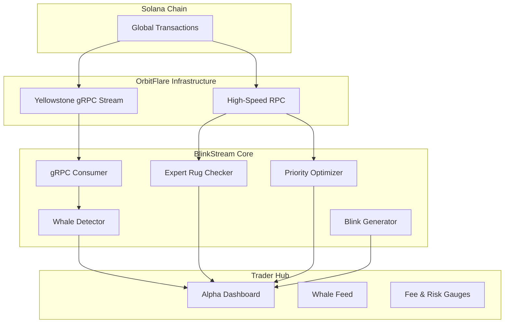

<p align="center">
  
  
  
  
</p>

# ⚡ BlinkStream: High-Alpha Signal Console

**Real-Time Solana gRPC Signals + Expert Rug Analytics + One-Click Trade Execution**

BlinkStream is a professional-grade Solana trading terminal that bridges the gap between raw on-chain data and instant execution. By leveraging **OrbitFlare's Yellowstone gRPC** infrastructure, BlinkStream ingests, analyzes, and weaponizes market signals in milliseconds.

> **Ingest → Detect → Audit → Execute** — The complete alpha pipeline in one unified dashboard.

---

## 🚀 Maximum Capability Highlights

### 🐋 Institutional "Whale" Stream (gRPC)
*   **Zero-Latency Ingestion**: Hooks directly into OrbitFlare's Yellowstone gRPC (Geyser) feed.
*   **Whale Tracking**: Detects institutional swaps (>$25k USD) 200-500ms before they hit standard explorers.
*   **Ring Buffer Persistence**: Maintains a rolling live feed of high-value moves for instant trend analysis.

### 🛡️ Rug Checker: Expert Mode
*   **LP Lock & Burn Verification**: Automatically parses Raydium pools to verify if liquidity is burned (1111...) or locked.
*   **Metadata Mutability Detection**: Flags tokens where creators can change the identity (Name/Symbol/Icon) post-launch—the ultimate "Honey-swap" loophole.
*   **Token-2022 Extension Audit**: Scans for advanced "Permanent Delegate" and "Transfer Fee" risks that allow devs to seize balances or block sells.
*   **DEX-Filtered Whale Analysis**: Strips out Liquidity Provider accounts to reveal real holder concentration.

### ⚡ Priority Fee Optimizer (Jito-Aware)
*   **Execution Guarantee**: Real-time gauge comparing network percentiles against **Jito Tip Floors**.
*   **Actionable Tiers**: Provides 3-tier fee recommendations (Safe, Standard, Turbo) to ensure your trades land in the *very next block* during surges.

### 📈 Autonomous Signal-to-Blink Engine
*   **Price Surge Monitoring**: Monitors a custom-built watchlist (SOL, BONK, JUP, etc.) via Pyth Hermes.
*   **Auto-Blink Generation**: When a threshold is hit, the system automatically generates a **Solana Action Blink**.
*   **One-Click Execution**: Share or execute swap Blinks directly from the console—pre-simulated and pre-quoted via Jupiter.

---

## 🏗️ Technical Architecture

BlinkStream is built for speed and reliability, deployed as a **single unified service** where the high-performance Express backend serves the React trading console.



---

## ✨ Features Breakdown

### 🔬 Expert Rug Analysis
*   **Score (0-100)**: Proprietary risk weighting based on 10+ granular on-chain flags.
*   **Mutability Scan**: Validates Metaplex V1 metadata records for mutability.
*   **Authority Audit**: Verifies Mint and Freeze authority status.
*   **Concentration Profile**: Animated visualization of the top 10 holders.

### 🛠️ Trader Intelligence Hub
A consolidated dashboard featuring 6 critical modules:
1.  **Overview / Watchlist**: Real-time surge monitoring for preferred assets.
2.  **Portfolio & P&L**: Live wallet valuation and token performance tracking.
3.  **Whale Stream**: Live gRPC institutional move feed.
4.  **Priority Fees**: Jito-aware network congestion and fee optimization.
5.  **Transaction Inspector**: Human-readable decoding of any Solana signature.
6.  **Settings**: Runtime-adjustable surge thresholds and cooldowns.

### 🔌 Developer & Deployment
*   **Render (Unified)**: Deploy effortlessly as a single service.
*   **Vite + React 19**: Modern, responsive trading UI with Framer Motion animations.
*   **Socket.IO**: Push-based signal delivery for instant UI updates.
*   **Pyth Network**: Real-time institutional-grade price feeds.

---

## ⚙️ Quick Start

1.  **Clone & Install**:
    ```bash
    git clone https://github.com/sunnysolana2003-crypto/BlinkStream.git
    cd blinkstream-unified-backend
    npm install --ignore-scripts
    ```
2.  **Environment Setup**:
    Configure `ORBITFLARE_API_KEY` and `ORBITFLARE_GRPC_URL` in `.env`.
3.  **Launch**:
    ```bash
    npm run dev
    ```

---

## 🔒 Hardened for Production
*   **Deduplication**: Stream signature dedupe with periodic cleanup.
*   **Anti-Spam**: Rate-limited signal generation.
*   **Demos**: Deterministic `DEMO_MODE` for safe presentations.
*   **Error Resilience**: Auto-reconnecting gRPC streams with exponential backoff.

---

<p align="center">
  <b>Built for the Solana Renaissance · Powered by OrbitFlare</b>
</p>
