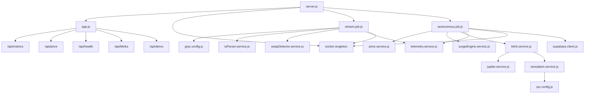

# BlinkStream Unified Backend: Unified + Hardened Architecture Guide

This document describes:

- How the 4 original layers were unified into one backend
- How modules interact at runtime
- The current final folder/file architecture
- Production hardening added after the merge

---

## 1) Unified Scope

Original layers:

- Layer 1: Infrastructure foundation
- Layer 2: OrbitFlare gRPC streaming
- Layer 3: Surge detection engine
- Layer 4: Autonomous Blink trigger engine

Unified target achieved:

- One Node.js backend
- One `server.js`
- One `package.json`
- One RPC connection singleton
- One Hermes client singleton
- One Socket.IO singleton
- Business logic isolated in services
- Scheduling/orchestration isolated in jobs

---

## 2) Merge Outcome by Layer

## Layer 1 (Infra Base)

Adopted as base architecture:

- Express app/server layout
- Auth middleware pattern
- Supabase client pattern
- Core routes for auth/price/metrics/blink

## Layer 2 (Streaming)

Integrated and refactored into:

- `src/config/grpc.config.js`
- `src/jobs/stream.job.js`
- `src/services/txParser.service.js`
- `src/services/swapDetector.service.js`

Key rule enforced:

- Streaming job orchestrates only
- Parsing/detection lives in services

## Layer 3 (Surge Engine)

Integrated into:

- `src/services/surgeEngine.service.js`

Key rule enforced:

- Service is stateful and pure for decisioning
- Polling remains in job (`autonomous.job.js`)

## Layer 4 (Autonomous Blink)

Integrated into pipeline services:

- `src/services/price.service.js`
- `src/services/jupiter.service.js`
- `src/services/simulation.service.js`
- `src/services/blink.service.js`

Orchestrated by:

- `src/jobs/autonomous.job.js`

## Demo Mode

Implemented via:

- `src/config/constants.js` (`DEMO_MODE`)
- `src/routes/demo.routes.js`
- Demo branches in Jupiter/simulation/autonomous flow

Behavior when `DEMO_MODE=true`:

- gRPC stream startup skipped
- Deterministic quote/simulation latencies
- Manual trigger available at `POST /api/demo/trigger`

---

## 3) Final Folder/File Architecture

```text
blinkstream-unified-backend/
│
├── package.json
├── package-lock.json
├── .env.example
├── UNIFIED_CODEBASE_GUIDE.md
│
├── src/
│   ├── server.js
│   ├── app.js
│   │
│   ├── config/
│   │   ├── rpc.config.js
│   │   ├── grpc.config.js
│   │   └── constants.js
│   │
│   ├── db/
│   │   └── supabase.client.js
│   │
│   ├── middleware/
│   │   ├── auth.middleware.js
│   │   └── error.middleware.js
│   │
│   ├── routes/
│   │   ├── auth.routes.js
│   │   ├── health.routes.js
│   │   ├── metrics.routes.js
│   │   ├── price.routes.js
│   │   ├── blink.routes.js
│   │   └── demo.routes.js
│   │
│   ├── services/
│   │   ├── price.service.js
│   │   ├── jupiter.service.js
│   │   ├── simulation.service.js
│   │   ├── blink.service.js
│   │   ├── txParser.service.js
│   │   ├── swapDetector.service.js
│   │   ├── surgeEngine.service.js
│   │   └── telemetry.service.js
│   │
│   ├── jobs/
│   │   ├── stream.job.js
│   │   └── autonomous.job.js
│   │
│   ├── sockets/
│   │   └── socket.js
│   │
│   └── utils/
│       └── logger.js
```

---

## 4) Runtime Interaction Model

## 4.1 Boot Sequence

1. `src/server.js` loads env.
2. HTTP server created from `src/app.js`.
3. Socket initialized once in `src/sockets/socket.js`.
4. If not demo mode, stream job starts.
5. Autonomous job starts.
6. Signal handlers (`SIGTERM`, `SIGINT`) perform graceful shutdown.

## 4.2 HTTP Layer

Mounted in `src/app.js`:

- `/api/metrics`
- `/api/price`
- `/api/health`
- `/api/blinks`
- `/api/demo`

Rate limiting applied to:

- `/api/blinks`
- `/api/demo`

## 4.3 Streaming Path

`src/jobs/stream.job.js`:

1. Open OrbitFlare subscription
2. Parse tx (`txParser.service`)
3. Detect large swaps (`swapDetector.service`)
4. Normalize event (`telemetry.service`)
5. Emit socket event (`large-swap`)

Hardening in stream path:

- Infinite reconnect loop with exponential backoff (`1s` to `15s`)
- Signature dedupe map
- Dedupe cleanup every 60 seconds
- Stream status state (connected, backoff, errors, reconnect count)

## 4.4 Autonomous Path

`src/jobs/autonomous.job.js` (5s interval):

1. Read price (`price.service`)
2. Evaluate surge (`surgeEngine.service`)
3. On surge, run blink pipeline:
   - Jupiter quote (`jupiter.service`)
   - Simulation (`simulation.service`)
   - Blink creation + stage latencies (`blink.service`)
4. Normalize event (`telemetry.service`)
5. Persist event if Supabase configured
6. Emit socket event (`surge`)

Hardening in autonomous path:

- 60-second anti-spam guard for blink creation
- Persistence errors handled without killing job

## 4.5 Health Path

`GET /api/health` returns:

- overall status
- mode (`demo` or `real`)
- stream status object from stream job
- rpcLatency (if probe succeeds)
- process uptime

---

## 5) Service Responsibilities

- `price.service.js`: token pricing + deterministic demo pricing
- `jupiter.service.js`: quote retrieval with timeout safety
- `simulation.service.js`: transaction simulation with timeout safety
- `blink.service.js`: orchestrates quote/sim/blink stages and latencies
- `txParser.service.js`: normalizes transfer data from stream messages
- `swapDetector.service.js`: large-swap threshold detection
- `surgeEngine.service.js`: threshold/cooldown surge decisioning
- `telemetry.service.js`: event normalization, metrics, optional persistence

---

## 6) Unified Event Contract

All emitted events are normalized through `buildStandardEvent` in `telemetry.service.js`:

```json
{
  "type": "SURGE",
  "token": "SOL",
  "changePercent": 3.2,
  "usdValue": 12000,
  "blink": {
    "blinkUrl": "...",
    "latency": {
      "quoteLatency": 14,
      "simulationLatency": 20,
      "blinkLatency": 4,
      "total": 38
    }
  },
  "slot": 257382992,
  "timestamp": 17123456789
}
```

Event `type` can be `SURGE` or `LARGE_SWAP`; structure remains identical.

---

## 7) Security and Stability Hardening

Implemented in-place:

- Structured logger utility (`src/utils/logger.js`)
- Console logging replaced with logger usage
- CORS restricted via `ALLOWED_ORIGINS`
- Rate limiting enabled (`express-rate-limit`)
- Input validation added:
  - email format
  - password minimum length
  - auth header token existence
  - positive numeric amount checks
- External timeout guards:
  - Jupiter: 3000ms
  - Simulation: 3000ms
- Graceful shutdown for `SIGTERM` / `SIGINT`

---

## 8) Singleton and Dependency Discipline

Singletons enforced:

- RPC connection: `getConnection()` (`rpc.config.js`)
- Hermes client: `getHermesClient()` (`rpc.config.js`)
- Socket instance: `initSocket()` singleton (`socket.js`)

Design constraints maintained:

- Services do not import Express
- Jobs orchestrate, services decide
- No circular imports (verified with `madge`)

---

## 9) Environment Notes

`.env.example` now includes hardening-related vars:

- `DEBUG`
- `ALLOWED_ORIGINS`
- existing chain/RPC/Jupiter/demo variables

Current practical note:

- In this local environment, `@kdt-sol/solana-grpc-client` currently throws a runtime compatibility error under Node `v24.x`.
- System remains resilient (reconnect + health visibility), but successful real stream consumption requires compatible runtime/package combination.

---

## 10) High-Level Diagram


